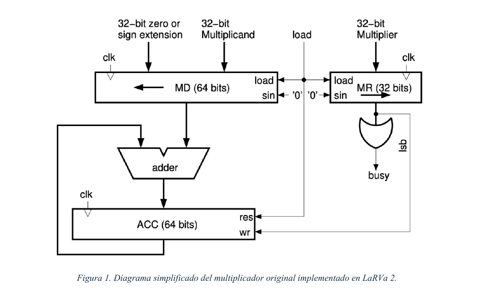
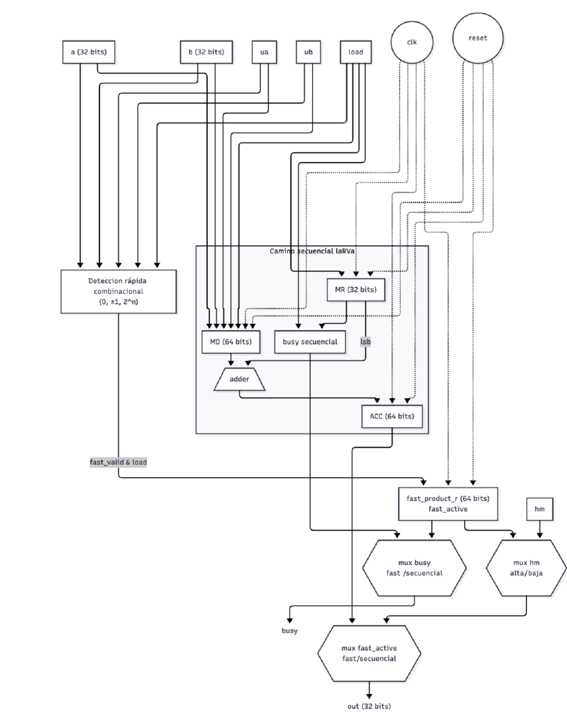
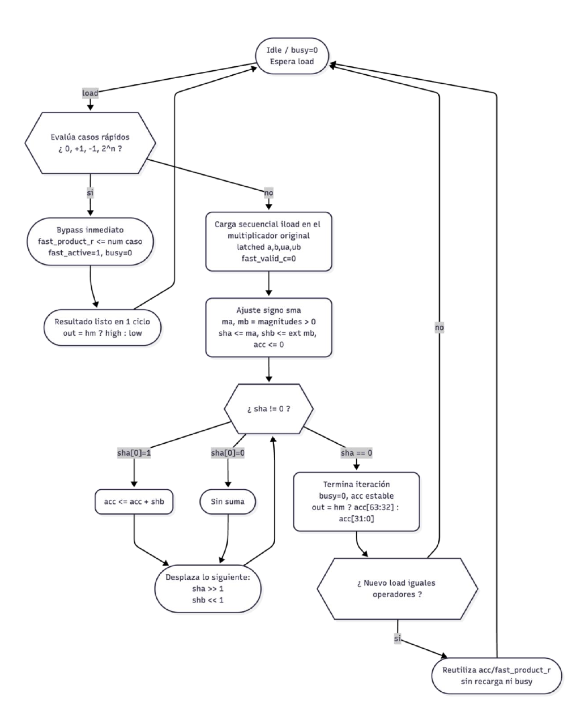
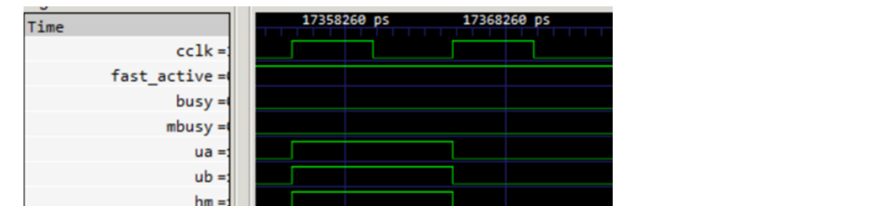

# Fast‑Path (Bypass) Hardware Multiplier for a RISC‑V Core

A redesigned **32‑bit integer multiplier** for the **LaRVa** RISC‑V soft core (RV32 + the *M* extension), written in Verilog and verified on an FPGA flow.

The original multiplier in the core is a classic *shift‑and‑add* unit: it spends roughly **one clock cycle per bit**, so even a trivial operation such as `x * 0` or `x * 1` keeps the CPU stalled for ~32 cycles. It also produced **wrong results** for some signed edge cases. This project replaces it with a drop‑in module that keeps the exact same interface but adds a **combinational fast path (a "bypass")** for the most common operations and fixes the correctness bugs.

> **Result:** multiplications by `0`, `±1` and powers of two now finish in **a single clock cycle** instead of ~32, signed overflow edge cases are computed correctly, and the rest of the processor required **no changes** beyond swapping one module.

---

## Table of contents

- [Why this matters](#why-this-matters)
- [The original design and its limitations](#the-original-design-and-its-limitations)
- [The new multiplier with bypass](#the-new-multiplier-with-bypass)
- [How the fast path works](#how-the-fast-path-works)
- [Results](#results)
- [Verification](#verification)
- [Repository layout](#repository-layout)
- [Build & simulate](#build--simulate)
- [Tech stack](#tech-stack)
- [Credits](#credits)

---

## Why this matters

In a small embedded CPU, the multiplier is on the critical path of any code that does arithmetic — loops, address calculations, fixed‑point math, etc. A sequential multiplier freezes the whole pipeline (`busy`/`mbusy` stays high) while it iterates over the operand bit by bit. Two observations drive this project:

1. **A huge fraction of real multiplications are trivial.** Compilers emit a lot of `× 0`, `× 1`, `× −1` and `× 2ⁿ` (the last one is just a shift). Paying 32 cycles for a shift is wasteful.
2. **The latency depended on the *data*, not the operation.** The unit stayed busy as long as there were `1` bits left in the multiplier register, so timing was unpredictable.

The goal was to accelerate these common cases **without changing the module's external interface**, so the new unit is fully interchangeable with the original inside the processor.

---

## The original design and its limitations

The stock multiplier is a 32‑bit shift‑and‑add core with three internal registers — a shift register for the multiplier (`MR`), a 64‑bit shift register for the sign/zero‑extended multiplicand (`MD`), and a 64‑bit accumulator (`ACC`). On each clock it shifts and conditionally adds; `busy` stays asserted until the multiplier register reaches zero.

<p align="center">
  
</p>

**Limitations found during analysis:**

- ⏱️ **Latency dominated by data**, not by the real complexity of the operation. Even `12345 × 0` or `1024 × 2048` (a pure shift) ran the full iterative loop.
- 🐞 **Incorrect results in two signed edge cases.** The sign handling converted operands to a positive magnitude in 32 bits, which **overflows for `0x8000_0000`** (the minimum signed 32‑bit integer). In a 44‑case test bench, tests **#42** and **#44** — involving `−2³¹` and `−1` — returned the wrong high word.

---

## The new multiplier with bypass

The new module (`mult_signo.v`) keeps the **identical port list** (`clk, reset, a, b, ua, ub, hm, load → busy, out`) and is built from **two parallel paths**:

| Path | What it does |
| --- | --- |
| **Sequential core** (`multiplier_seq`) | The original shift‑and‑add algorithm, kept untouched, for the general case. |
| **Fast combinational path** | Detects trivial operands and computes the full 64‑bit product directly, in one cycle. |

A small block of comparators inspects the operands and raises `fast_valid_c` when a trivial pattern is detected, producing `fast_product_c` combinationally. When that happens, the sequential core is **inhibited** (its `load` is gated with `~fast_valid_c`), so `busy` is never asserted and the result is available immediately. Final multiplexers select between the fast result and the sequential result, and between the low/high word according to `hm`.

<p align="center">
  
  &nbsp;&nbsp;&nbsp;
  
</p>
<p align="center"><em>Left: two‑path architecture (combinational detector + sequential core + output muxes). Right: ASM chart of the control flow.</em></p>

A result register (`fast_product_r` + `fast_active`) caches the last fast product so that a follow‑up instruction reading the **other half** of the product (e.g. `MUL` followed by `MULH` on the same operands) is served without recomputing anything.

---

## How the fast path works

The detector recognises and resolves these patterns combinationally:

| Case | Detection | Result (one cycle) |
| --- | --- | --- |
| **× 0** | `a == 0` or `b == 0` | full 64‑bit `0` |
| **× 1** | operand `== 1` | the other operand (sign/zero extended) |
| **× −1** | signed operand `== 0xFFFF_FFFF` | two's‑complement negation of the other operand |
| **× 2ⁿ** | `value & (value − 1) == 0` (one bit set, in absolute value) | the other operand **shifted** by *n*, sign applied afterwards |

The **signed‑overflow bug is also fixed**: instead of taking a 32‑bit absolute value (which overflows at `0x8000_0000`), operands are **sign‑extended to 64 bits first** and the product is computed at full width, applying the final sign with dedicated control signals. Tests #42 and #44 now pass.

---

## Results

**Latency** — trivial operations collapse from ~32 cycles to **1 cycle**:

<p align="center">
  
</p>
<p align="center"><em>Inside the running CPU: <code>12345 × 1</code>. <code>busy</code>/<code>mbusy</code> stay low and <code>out</code> shows <code>12345</code> in the same cycle the operands are presented.</em></p>

**Correctness** — all 44 test‑bench cases pass, including the two that the original unit got wrong:

| Test | A | B | Mode | Original | New | Expected |
| --- | --- | --- | --- | --- | --- | --- |
| #42 | `−1` | `−2³¹` | `MULH` | ❌ `−1` | ✅ `0` | `0` |
| #44 | `−2³¹` | `−2³¹` | `MULH` | ❌ `−1073741824` | ✅ `1073741824` | `1073741824` |

**Area** (synthesis estimate on a low‑end FPGA, comparable in capacity to the Lattice iCE40HX target):

| Metric | Original | With bypass |
| --- | --- | --- |
| Logic elements | ~351 | ~1656 (≈ 5×) |
| of which combinational | 285 | 1590 |
| Registers | 226 | 291 |
| Embedded multiplier blocks | 0 | 0 |

The extra logic is the price of the parallel detector, the 64‑bit fast datapath and the selection muxes. It stays modest within a low‑end FPGA and is justified by the latency win on common operations and the corrected edge cases.

---

## Verification

The design was validated at two levels:

1. **Isolated test bench** (`multiplier_4bit_tb.v`) — drives the module directly with a **44‑case suite** covering positive/negative/mixed signs, maximum signed and unsigned values, zeros, powers of two, bit patterns and random operands. A golden 64‑bit reference is computed in the test bench and compared against `out` for both the low (`hm=0`) and high (`hm=1`) words. Waveforms were inspected in GTKWave.
2. **In‑CPU validation** (`Firmware/start.s`) — the same 44 vectors were ported to a **RISC‑V assembly routine** that runs on the integrated core, executing real `MUL`, `MULH`, `MULHSU` and `MULHU` instructions and recording every result (and its delta vs. expected) into memory for inspection. This confirms the unit behaves correctly once integrated, not just in isolation.

---

## Repository layout

```
.
├── mult_signo.v            ← the contributed multiplier (fast path + sequential core)
├── multiplier_4bit_tb.v    ← isolated 44-case test bench for the multiplier
├── laRVa.v                 ← the RISC-V core (multiplier instantiated here)
├── system.v, uart.v, pll.v, main.v   ← SoC: RAM, UART, PLL, FPGA top level
├── tb.v, tb_divider.v      ← full-system and divider test benches
├── pines.pcf               ← FPGA pin constraints (iCE40HX8K)
├── Firmware/               ← bare-metal C + assembly firmware
│   ├── start.s             ← boot code + the in-CPU multiplier validation routine
│   ├── main.c, printf.c …  ← sample firmware
│   └── Makefile            ← RISC-V GCC build (rv32em)
├── tovhex.c                ← code.bin → rom.hex converter (ROM image for sim/synth)
├── Makefile                ← simulation + synthesis flow
└── docs/img/               ← diagrams used in this README
```

---

## Build & simulate

The build relies on a standard open‑source FPGA toolchain. Paths to the tools are configured at the top of the `Makefile`.

```bash
# 1. Build the firmware (RISC-V GCC, rv32em) and the ROM image
make -C Firmware            # → Firmware/code.bin
./tovhex.exe Firmware/code.bin rom.hex

# 2. RTL simulation of the full system (Icarus Verilog + GTKWave)
make sim                    # compiles tb.v, runs vvp, opens tb.vcd

# 3. Standalone multiplier test bench
iverilog -o mult_tb.out multiplier_4bit_tb.v && vvp mult_tb.out

# 4. FPGA bitstream for the Lattice iCE40HX8K (Yosys → nextpnr → icepack)
make main.bin
make burn                   # program the board
```

**Toolchain:** [Icarus Verilog](http://iverilog.icarus.com/) + [GTKWave](https://gtkwave.sourceforge.net/) for simulation; [Yosys](https://yosyshq.net/yosys/) + [nextpnr‑ice40](https://github.com/YosysHQ/nextpnr) + [IceStorm](https://github.com/YosysHQ/icestorm) for synthesis; a `riscv-none-elf-gcc` cross‑compiler for the firmware.

---

## Tech stack

`Verilog` · `RISC‑V (RV32IM / RV32EM)` · `FPGA` · `Lattice iCE40HX8K` · `Yosys / nextpnr / IceStorm` · `Icarus Verilog` · `GTKWave` · `RISC‑V GCC` · digital design (shift‑and‑add multiplier, combinational bypass, two's‑complement arithmetic).
